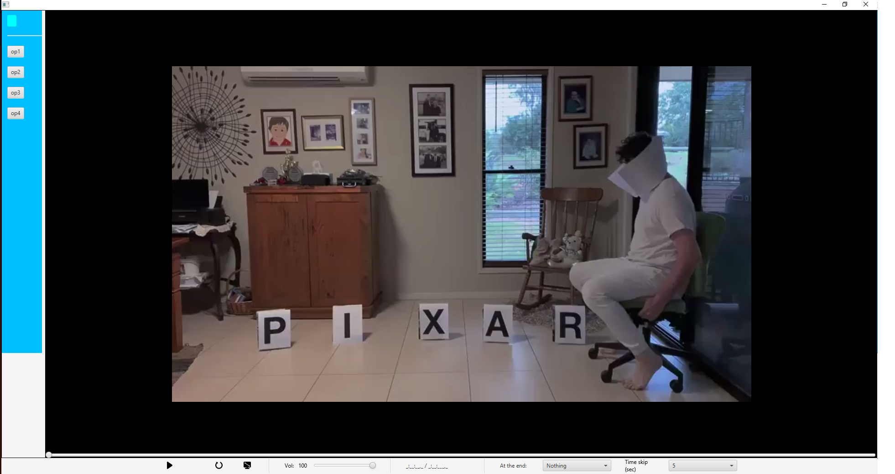
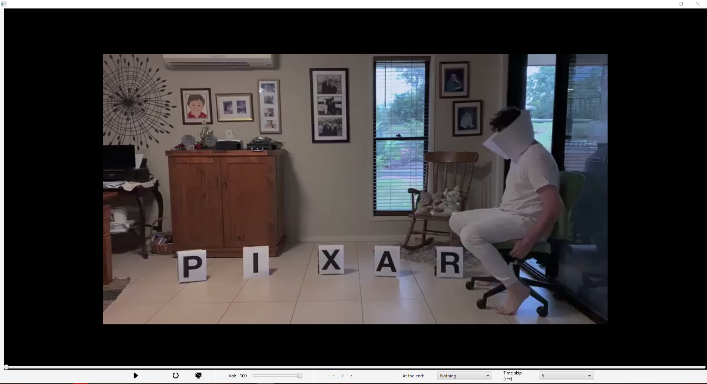

# Player javaFX
## Projeto pessoal não terminado de um player feito em Java entre 2019-2020

Eu acabei perdendo o documento em que eu documentava as mudanças, erros e avanços no programa, então posso ter deixado passar alguma coisa.

---

## Linguagens e ferramentas utilizadas:

- Java
- JavaFX
- XML
- CSS

## Funções

- Mostra o momento atual do vídeo (HH:MM:SS)
- Reproduzir e pausar (mesmo botão para isso, trocam o ícone conforme a função)
- Reiniciar o vídeo
- Slider de tempo
- Controle de volume
- Avançar e retroceder (com possibilidade de escoher os segundos 1, 2, 5 e 10 segundos)
- Escolher o que fazer ao acabar o vídeo (Nada, reproduzir de novo, próximo vídeo ou o anterior)
- Barra lateral que fecha quando se tira o mouse (para dar mais visibidade ao player)
- Funções extras como preserve ratio (Manter proporção ou preencher toda a tela)

## Erros conhecidos

- Ícones de avançar/retroceder perdidos ou excluídos.
- Reprodutor as vezes buga ao mexer no slider, ficando mais lento
- Falta de responsividade (O projeto foi feito pensando na resolução máximo do notebook que usava (1366x768), logo resoluções maiores ficarão com bordas pretas ao redor do vídeo)

