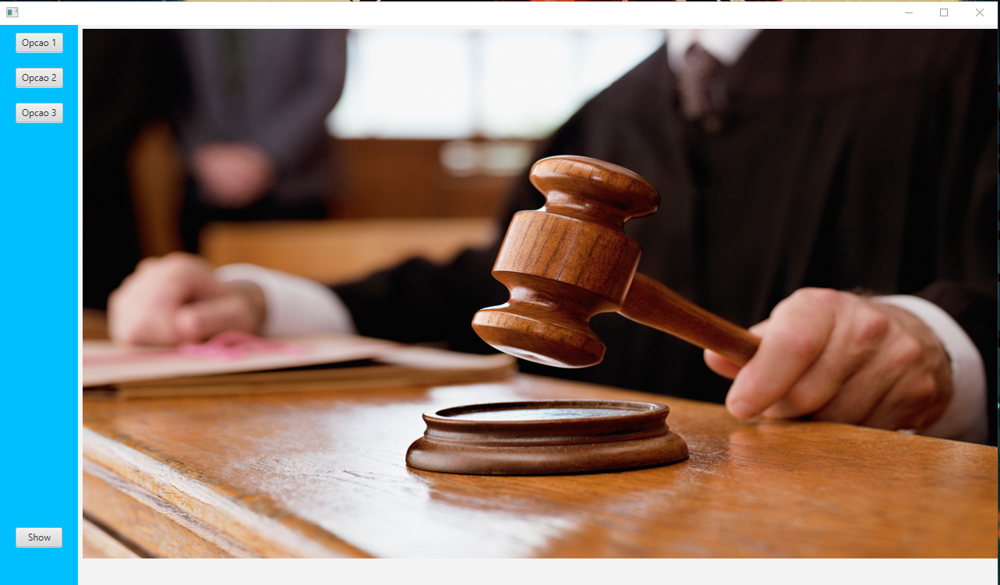

# Player javaFX
## Projeto pessoal não terminado de um player feito em Java entre 2019-2020

Arquivo com log nas mudanças recuperado!

---

## Linguagens e ferramentas utilizadas:

- Java
- JavaFX
- XML
- CSS

## Funções

- Recursos básicos de vídeo (reproduzir, pausar, reiniciar).
- Conseguir abrir de pastas externas (usando o file e absolutepath).
- Mostra o momento atual do vídeo (HH:MM:SS)
- Reproduzir e pausar (mesmo botão para isso, trocam o ícone conforme a função)
- Slider de tempo
- Controle de volume
- Avançar e retroceder (com possibilidade de escoher os segundos 1, 2, 5 e 10 segundos)
- Escolher o que fazer ao acabar o vídeo (Nada, reproduzir de novo, próximo vídeo ou o anterior)
- Barra lateral que fecha quando se tira o mouse (para dar mais visibidade ao player)
- Funções extras como preserve ratio (Manter proporção ou preencher toda a tela)

## Erros corrigos

FIX:

- BUG ao voltar pro menu e voltar pro player ficava o ultimo video pausado na posição de antes.
	- Ele volta pro mesmo vídeo mas pro começo deste.
- BUG ao voltar pro menu (continuar reproduzindo).
- BUG ao colocar pra repetir ele não mudava o icone do play/pause.
- BUG de ao mostrar o tempo não atualizar corretamente (passava de 60 segundos e provavelmente de 60 minutos).
- Tela não se encaixar perfeitamente ao retirar o label pertencente ao botão de colocar tela cheia.
- O número do volume muda mesmo sem escolher nenhum vídeo.

## Erros conhecidos

- Recurso não intencional = ao voltar pro menu e voltar pro player ele salva o ultimo video visto.
- Ícones de avançar/retroceder perdidos ou excluídos.
- Reprodutor as vezes buga ao mexer no slider, ficando mais lento
- Falta de responsividade (O projeto foi feito pensando na resolução máximo do notebook que usava (1366x768), logo resoluções maiores ficarão com bordas pretas ao redor do vídeo)

## Planejamento futuro

Prioridade alta:
	- Testar previews (virtual Dub).
	- Esconder o sliderVideo e os botões de média após um tempo.
	
Prioridade média:
	- Deixar um texto ao passar mouse por cima dos botões das opções.

Prioridade baixa:
	- Procurar um estilo maior.
	- Procurar como evitar essa mensagens de tela cheia.
	- Salvar o volume em um arquivo.
	- Usar scroll do mouse para definir o volume.
	- Usar setas para dar skip e back.
	- efeito de ocultar a aba mais sutil.
	- Implementar lógica de next e back videos.
	
Upgrade:
	- Implementar uma forma do programa reconhecer os arquivos de video, atribuir os caminhos corretos e colocar o nome deles nos botões.
			- para os arquivos em gerais.
	- Após os recursos basicos estarem nos conformes, implementar uma forma de jogar o dist ou .exe e criar as opções de acordo com os arquivos dispostos na página.

